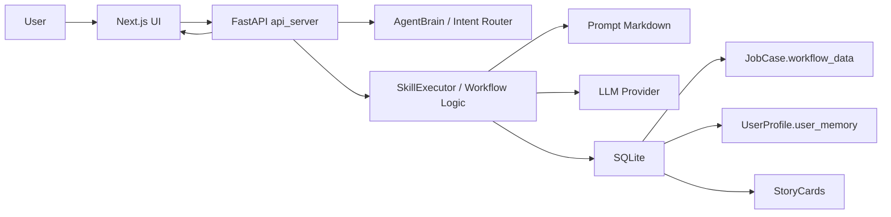
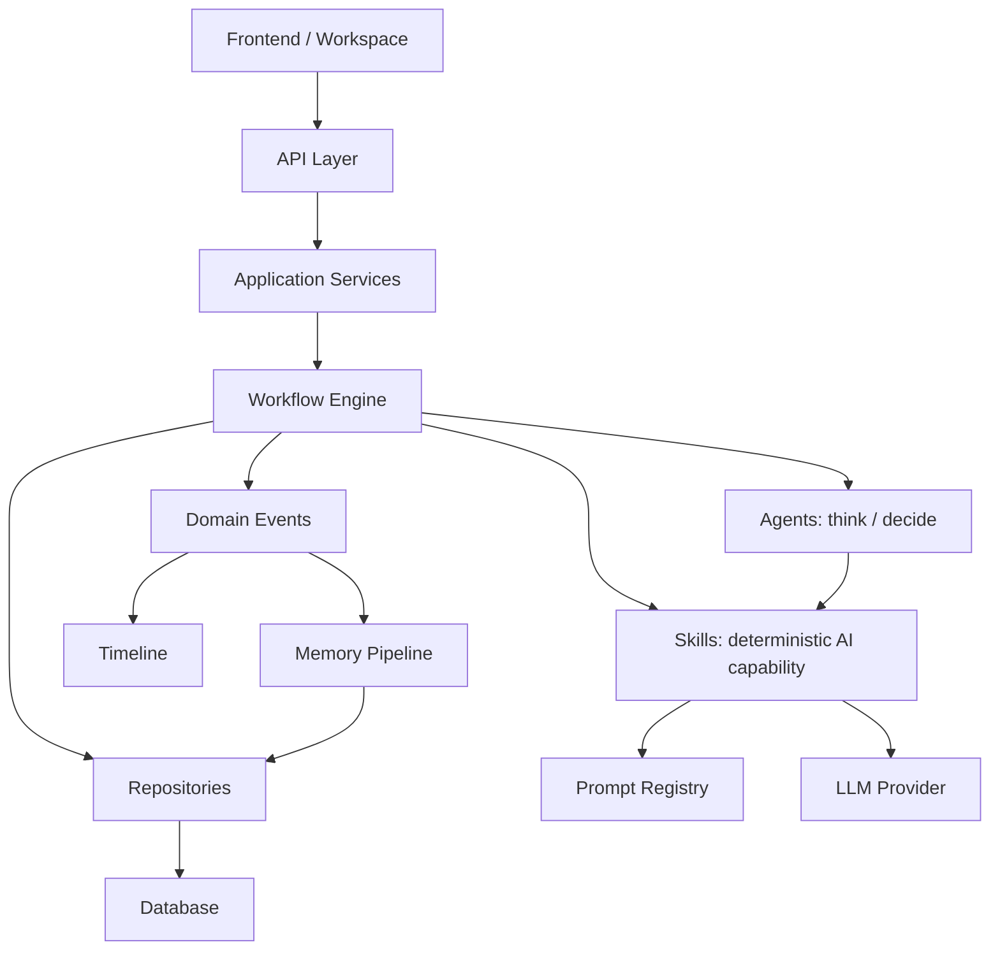
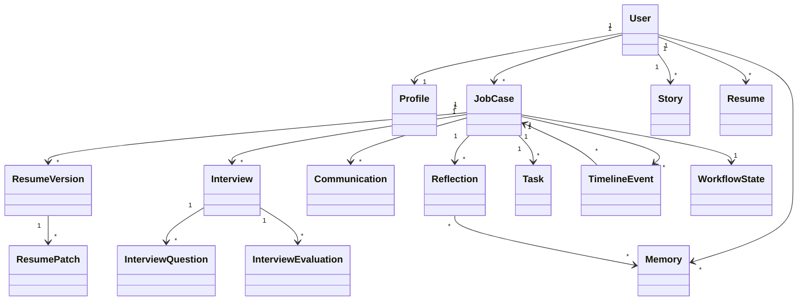
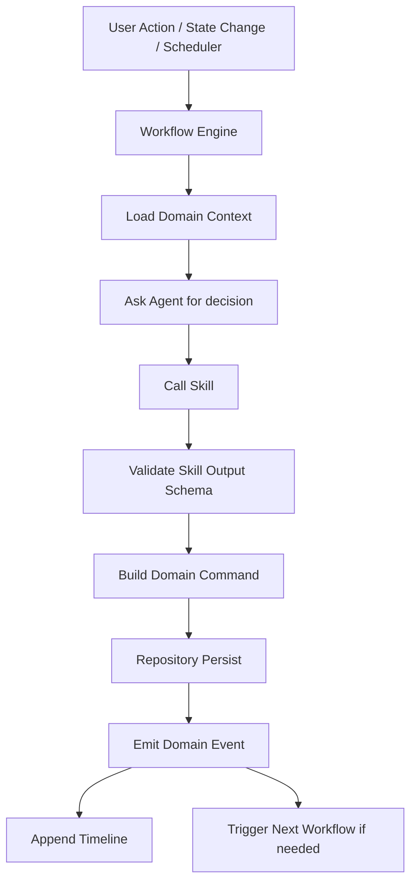
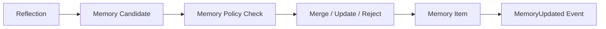

# OfferFlow Architecture Blueprint

## 0. Purpose

OfferFlow is an AI Native Job Search OS. Its core is not AI Chat, but a Job Case centered system that helps users complete the full job-search lifecycle: JD analysis, job matching, resume optimization, interview preparation, interview evaluation, reflection, communication, and long-term growth.

This blueprint is the top-level architecture guideline for future development. It follows DDD, AI Native product design, multi-agent system design, long-term maintainability, and evolutionary architecture.

---

## 1. Current Architecture

Current implementation:

- Frontend: Next.js workspace UI calls FastAPI directly.
- Backend: FastAPI currently mixes API routing, Agent Brain, workflow orchestration, skill execution, SSE streaming, and persistence.
- Database: SQLite contains `job_cases`, `user_profiles`, `chat_messages`, and `story_cards`.
- Workflow: mostly user-triggered and API-driven.
- Agent: `AgentBrain` acts as intent router and central decision maker.
- Skill: implemented through `SkillExecutor`, calling prompt files and LLM.
- Prompt: markdown prompt assets under `prompts/`.
- Memory: currently scattered across `UserProfile.user_memory`, `StoryCard`, and `JobCase.workflow_data`.



Biggest strength: OfferFlow already has the right product direction. Job Case, Skill, Prompt, Evaluation, Story Bank, Interview Prep, and Reflection all exist as early concepts.

Biggest risk: core domain objects are not yet first-class. Too much business state is stored in `workflow_data`, which will not support multiple resume versions, multi-round interviews, communication history, long-term reflection, memory evolution, or multi-agent collaboration.

---

## 2. Recommended Architecture

Recommended architecture: lightweight Clean Architecture + DDD + event-driven workflow.



Rules:

- Agent does not own data.
- Agent thinks, reasons, and recommends.
- Workflow executes.
- Repository persists.
- Skill has fixed input, output, schema, error codes, and version.
- Job Case is the aggregate root for job-specific lifecycle.
- User owns long-term assets such as Profile, Master Resume, Story Bank, and Memory.
- Timeline/Event records what happened.
- Memory Pipeline decides what becomes long-term learning.

---

## 3. Domain Model



Domain objects:

- User: owner of all long-term assets.
- Profile: stable personal facts, goals, preferences.
- Job Case: core aggregate for one target role/application.
- Resume: long-term user resume asset.
- Resume Version: job-specific resume branch.
- Resume Patch: localized AI suggestion.
- Interview: one concrete interview round.
- Communication: Boss, HR, email, follow-up, offer negotiation record.
- Reflection: structured learning from interview or job-search events.
- Task: user or workflow generated action item.
- Timeline Event: immutable record of important lifecycle events.
- Story: reusable experience asset extracted from resume/reflection.
- Memory: long-term learning unit.
- Workflow State: current state of a workflow or job lifecycle.
- Event: immutable domain event.

---

## 4. Aggregate Roots

MVP aggregate roots:

- User
- JobCase
- ResumeVersion
- Interview
- MemoryItem

Next-stage aggregate roots:

- CommunicationThread
- Reflection

Future aggregate roots:

- TaskPlan
- LearningTrack

Ownership:

- Belongs to User: Profile, Master Resume, Story Bank, long-term Memory, preferences.
- Belongs to Job Case: JD, matching result, job-specific resume versions, interviews, communications, tasks, reflections, timeline, workflow state.
- Independent assets: Prompt Version, Skill Definition, Evaluation Dataset, LLM Run Log.

Modification rules:

- Agent cannot directly modify aggregates.
- Workflow can issue domain commands.
- Repository persists aggregate changes.
- Master Resume cannot be changed by AI automatically; it requires user-confirmed merge.
- Memory cannot be written by arbitrary skills; it must pass through Memory Pipeline.

---

## 5. Conceptual Database Model

Tables:

- users
- profiles
- job_cases
- job_case_events
- timeline_events
- workflow_states
- resumes
- resume_versions
- resume_patches
- interviews
- interview_questions
- interview_evaluations
- communications
- reflections
- tasks
- stories
- memory_items
- memory_sources
- skill_runs
- agent_runs

Relationships:

- `profiles.user_id -> users.id`
- `job_cases.user_id -> users.id`
- `resume_versions.job_case_id -> job_cases.id`
- `resume_versions.resume_id -> resumes.id`
- `resume_patches.resume_version_id -> resume_versions.id`
- `interviews.job_case_id -> job_cases.id`
- `communications.job_case_id -> job_cases.id`
- `reflections.job_case_id -> job_cases.id`
- `tasks.job_case_id -> job_cases.id`
- `timeline_events.job_case_id -> job_cases.id`
- `memory_items.user_id -> users.id`
- `memory_sources.memory_item_id -> memory_items.id`

Version strategy:

- Resume must be versioned.
- Prompt must be versioned.
- Skill schema must be versioned.
- Memory item should support revision/history.

Cascade strategy:

- Deleting/archiving Job Case may cascade job-specific drafts, but timeline/events should be preserved or archived.
- User-level memory should not be deleted when a Job Case is removed.
- Resume versions preserve history.

---

## 6. Workflow Architecture



User-triggered workflows:

- Create Job Case
- Upload Resume
- Analyze JD
- Optimize Resume
- Prepare Interview
- Submit Interview Record
- Generate Greeting / Follow-up

State-triggered workflows:

- `JDAnalyzed` -> Job Matching
- `InterviewScheduled` -> Interview Prep
- `InterviewCompleted` -> Interview Evaluation
- `InterviewEvaluated` -> Reflection
- `ReflectionCreated` -> Memory Extraction
- `Applied` -> Follow-up Task

Automatic workflows:

- Interview reminder
- Follow-up reminder
- Weakness review
- Resume merge suggestion

Workflow rules:

- Workflow does not directly write raw database tables.
- Workflow calls Repository or Domain Service.
- Workflow owns transaction boundaries.
- Workflow calls Agent for decisions and Skill for AI reasoning.
- Skill output must be validated before persistence.

---

## 7. Agent Architecture

Case Manager Agent:

- Responsible for Job Case status, next best action, task planning.
- Reads JobCase, Timeline, Tasks, WorkflowState.
- Cannot directly modify Resume or Memory.
- Triggers status workflows.
- Hands off resume work to Resume Agent, interview work to Interview Agent.

Resume Agent:

- Responsible for resume diagnosis, optimization strategy, patch proposal, merge proposal.
- Reads Profile, Master Resume, ResumeVersion, JD Analysis, Matching, Story Memory.
- Can propose ResumePatch and MergeProposal through Workflow.
- Cannot directly modify Master Resume.

Interview Agent:

- Responsible for interview preparation, mock question strategy, evaluation context.
- Reads JD Analysis, ResumeVersion, Story Memory, Weakness Memory, Interview history.
- Calls Interview Prep and Interview Evaluation Skills.
- Hands long-term learning to Reflection Agent / Memory Agent.

Reflection Agent:

- Responsible for turning interview/job-search experience into structured reflection.
- Reads Interview, Evaluation, Timeline, Communication.
- Outputs Reflection and Memory Candidates.
- Cannot directly update Memory without Memory Pipeline.

Communication Agent:

- Responsible for Boss greeting, HR follow-up, thank-you notes, offer negotiation messages.
- Reads JobCase, Resume highlights, Communication history, user tone preference.
- Cannot fabricate experience.
- Creates Communication drafts or records through Workflow.

Memory Agent:

- Responsible for extracting, merging, updating, expiring, and resolving Memory conflicts.
- Reads Reflection, Story, Communication, Skill Runs, user confirmations.
- Writes Memory only with source, confidence, scope, and policy.

---

## 8. Skill Architecture

Every Skill must define:

- name
- version
- input_schema
- output_schema
- error_codes
- dependencies
- prompt_version
- evaluation_set

MVP skills:

1. JD Analysis
   - Input: `jd_raw_text`
   - Output: `jd_analysis_result`
   - Errors: `INVALID_JD`, `EMPTY_INPUT`, `LLM_PARSE_FAILED`

2. Job Matching
   - Input: `jd_analysis_result`, `resume_snapshot`
   - Output: `match_score`, `gaps`, `evidence`
   - Errors: `MISSING_JD_ANALYSIS`, `MISSING_RESUME`, `SCHEMA_INVALID`

3. Resume Optimization
   - Input: `resume_version`, `jd_analysis_result`, `job_matching_result`
   - Output: `resume_patches`
   - Errors: `INVALID_RESUME`, `UNSUPPORTED_PATCH`, `LOW_CONFIDENCE`

4. Content Generation
   - Input: `resume_version`, `generation_purpose`
   - Output: `renderable_resume` or `generated_content`
   - Errors: `MISSING_RESUME_VERSION`, `GENERATION_FAILED`

5. Interview Prep
   - Input: `jd_analysis_result`, `resume_version`, `story_memory`, `weakness_memory`
   - Output: `prep_pack`
   - Errors: `MISSING_JD`, `MISSING_RESUME`, `NO_RELEVANT_STORIES`

6. Interview Evaluation
   - Input: `interview_record`, `prep_pack`
   - Output: `evaluation`
   - Errors: `MISSING_RECORD`, `INSUFFICIENT_ANSWER`, `SCHEMA_INVALID`

7. Reflection
   - Input: `evaluation`, `job_context`
   - Output: `reflection`, `memory_candidates`
   - Errors: `MISSING_EVALUATION`, `NO_REFLECTION_SIGNAL`

8. Greeting / Follow-up
   - Input: `job_case`, `resume_highlights`, `communication_goal`
   - Output: `message_draft`
   - Errors: `MISSING_CONTEXT`, `UNSAFE_CLAIM`

Next skills:

- Memory Extraction
- Story Extraction
- Resume Merge Proposal
- Task Planning
- Communication Summary

Future skills:

- Offer Negotiation
- Career Strategy
- Multi-Job Portfolio Optimization

---

## 9. Memory System

Memory types:

- Profile Memory: stable user facts, goals, preferences.
- Story Memory: projects, STAR details, ability tags, evidence.
- Reflection Memory: abstracted learning from interviews/applications.
- Skill Memory: validated expressions or strategies from past skill use.
- Weakness Memory: recurring skill gaps or answer weaknesses.
- Communication Memory: tone preferences, HR interaction facts, follow-up context.

Each Memory item must include:

- source_type
- source_id
- confidence
- updated_at
- scope
- user_confirmed
- can_generate
- auto_update_allowed
- expires_at
- status

Memory usage:

- Agents retrieve Memory by scope and task.
- Skills receive only selected Memory, not full history.
- Memory is never raw chat dump.
- Reflection is the primary Memory creation source.
- User confirmation is required for sensitive or generative-use Memory.

Memory update flow:



---

## 10. Timeline

Mandatory events:

- JDUploaded
- JDAnalyzed
- JobMatched
- ResumeVersionCreated
- ResumeOptimized
- ResumePatchAccepted
- ResumeMerged
- Applied
- InterviewScheduled
- InterviewPrepGenerated
- InterviewCompleted
- InterviewEvaluated
- ReflectionCreated
- MemoryUpdated
- CommunicationDrafted
- CommunicationSent
- FollowUpScheduled
- OfferReceived
- Rejected
- Archived

Timeline helps Agent by providing:

- What happened
- When it happened
- Which workflow caused it
- Which object changed
- What should happen next

Timeline is the context skeleton for Agent reasoning.

---

## 11. Target Folder Structure

```text
offerflow/
  frontend/
  runtime/
    api/
    application/
    domain/
      user/
      job_case/
      resume/
      interview/
      communication/
      reflection/
      memory/
      task/
      timeline/
    workflows/
    agents/
    skills/
    prompts/
    repositories/
    database/
    events/
    llm/
    evaluation/
    shared/
  docs/
    architecture/
    product/
    prompts/
    workflows/
```

This is a target direction, not a one-shot migration requirement.

---

## 12. Migration Plan

Phase 1: Define contracts without moving code.

- Define Job Case lifecycle.
- Define Skill schema contracts.
- Define Event taxonomy.
- Define Memory item schema.
- No large refactor.

Phase 2: Extract first-class domain concepts.

- Introduce ResumeVersion concept.
- Introduce Interview concept.
- Introduce Reflection concept.
- Keep old `workflow_data` compatibility.

Phase 3: Add Timeline/Event recording.

- Append events after existing workflows.
- Do not yet make workflows fully event-driven.
- Use timeline for audit and future Agent context.

Phase 4: Introduce Repository/Application Services.

- Move persistence logic workflow by workflow.
- Keep API behavior stable.
- Avoid broad rewrites.

Phase 5: Build Memory Pipeline.

- Reflection outputs memory candidates.
- User confirms important memory.
- Memory stores source, confidence, scope, and status.

Phase 6: Split Agent responsibilities.

- Case Manager Router first.
- Resume Agent next.
- Interview Agent next.
- Memory Agent last.

Phase 7: Event-driven workflows.

- State changes trigger downstream workflows.
- Buttons remain as explicit user controls.
- Scheduler handles reminders and follow-up.

---

## 13. Long-term Architecture Guidelines

- Job Case is the core aggregate for job-specific lifecycle.
- Domain Object is more important than Workflow.
- Do not put long-term business objects into `workflow_data`.
- `workflow_data` is only for temporary workflow cache.
- Resume must be versioned.
- Master Resume cannot be modified automatically by AI.
- Prompt must be versioned.
- Skill schema must be versioned.
- Timeline/Event must preserve history.
- Memory must have source, confidence, scope, confirmation, and usage policy.
- Agent does not own data.
- Workflow executes.
- Repository persists.
- Skill returns structured results only.
- Reflection is the main source of long-term learning.
- Communication must be first-class, not hidden in chat messages.
- Interview must be first-class and support multiple rounds.
- All AI-generated career-impacting content must be explainable, traceable, and reversible.

Core architecture sentence:

OfferFlow should not become a pile of prompts. It should become a Job Case centered domain system where Agent, Workflow, Skill, Timeline, and Memory work together around stable domain objects.
