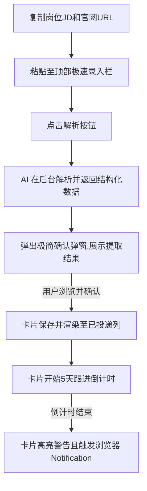

# JobSync Lite - 智能解析与倒计时追踪设计规范

本文档定义了 JobSync Lite 的核心功能升级设计。该升级旨在帮助秋招求职者以极简的步骤，通过 AI 提取杂乱招聘信息、自动记录投递状态与官网链接，并进行 5 天周期的精准跟进提醒。

## 1. 核心业务流程

## 2. 详细设计与交互变更

### 2.1 顶部极速录入栏 (Quick Input Bar)
- 在页面顶部 Header 下方，看板上方，增加一个常驻的玻璃质感录入区域。
- 包含：
  - 一个大文本框：`[ 粘贴岗位描述/JD... ]`
  - 一个小输入框：`[ 粘贴官网投递/查询链接 (URL) ]`
  - 一个渐变按钮：`[ ⚡ 智能识别并录入 ]`

### 2.2 AI 解析预览弹窗 (AI Parse Confirmation Modal)
- 当用户点击“智能识别并录入”后，前端调用大模型 API。
- 解析成功后，**自动弹出**一个预览确认弹窗，向用户展示 AI 提取的结果：
  - **公司名称** (AI 提取)
  - **投递岗位** (AI 提取)
  - **工作城市** (AI 提取)
  - **投递日期** (默认为今天)
  - **官网链接** (用户贴入的 URL)
  - **跟进周期** (默认 5 天)
- 用户只需要看一眼，无需任何打字操作，直接点击 **确认并保存** 即可创建卡片并归入“已投递 / 待笔面试”列中。如果发现 AI 提取有小瑕疵，也可以在弹窗中直接微调修改。

### 2.3 看板卡片外观升级 (Kanban Card Upgrade)
- 卡片增加直观按钮与提示条：
  - **🔗 官网链接** 按钮：直接放置在卡片中。点击它直接在浏览器新标签页打开官网，方便快速查询投递进度（如进入笔试/面试）。
  - **⏳ 进度追踪倒计时条**：
    - 根据 `投递日期 + 5天` 计算跟进截至日期。
    - 距离跟进还剩 3~5 天：显示绿色指示条（安全）。
    - 距离跟进还剩 1~2 天：显示黄色指示条（警告）。
    - 距离跟进已经到期或超期：显示红色高亮条，并附带 ⚠️ 标志。

### 2.4 到期提醒机制 (Follow-up Reminder)
- 每次打开或刷新页面时，系统会自动扫描所有未处于“流程结束 / 归档”状态的卡片。
- 对已经到达 5 天跟进期限的卡片，除了在卡片上标红之外，会使用浏览器的 `Web Notification API` 弹窗提醒用户。

### 2.5 搜索与筛选功能 (Filter & Search)
- 在极速录入栏下方、看板上方，增加一行用于快速检索和筛选卡片的控制栏。
- 包含：
  - **搜索框**：支持对“公司名称”、“岗位名称”、“工作城市”和“备注”进行实时模糊搜索。
  - **状态过滤器**：
    - 一键筛选 **“⚠️ 仅看超期滞留”**：点击后看板仅显示所有触发了超时跟进警告的岗位，方便集中处理。
    - **“全部”** 按钮：恢复显示所有卡片。
